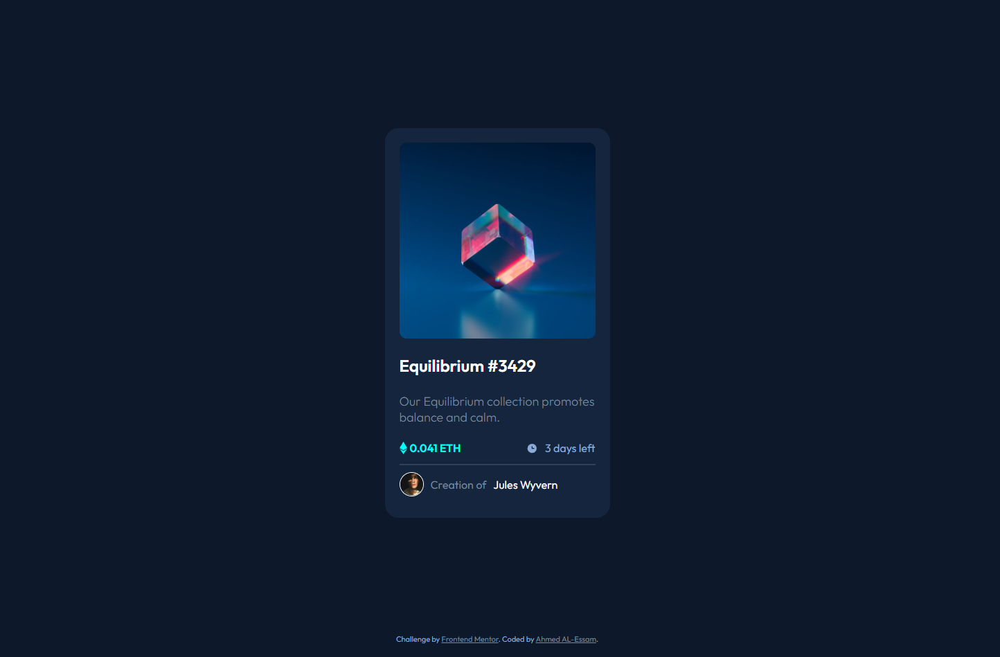
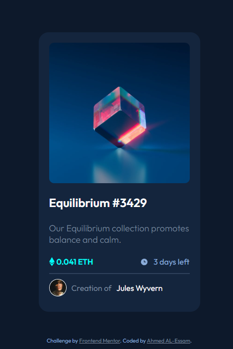

# Frontend Mentor - QR code component solution
### Challange by Frontend Mentor - Presented by  [RE:Coded](https://www.re-coded.com/)

This is a solution to the [QR code component challenge on Frontend Mentor](https://www.frontendmentor.io/challenges/qr-code-component-iux_sIO_H). Frontend Mentor challenges help you improve your coding skills by building realistic projects. 

## Table of contents

- [Frontend Mentor - QR code component solution](#frontend-mentor---qr-code-component-solution)
    - [Challange by Frontend Mentor - Presented by  RE:Coded](#challange-by-frontend-mentor---presented-by--recoded)
  - [Table of contents](#table-of-contents)
  - [Overview](#overview)
    - [Screenshot](#screenshot)
    - [Links](#links)
  - [My process](#my-process)
    - [Built with](#built-with)
    - [What I learned](#what-i-learned)
  - [Author](#author)

## Overview

### Screenshot
|                                                   *Desktop*                                                   |
| :-----------------------------------------------------------------------------------------------------------: |
|  |

|                                                   *Mobile*                                                   |
| :----------------------------------------------------------------------------------------------------------: |
|  |

 
### Links

- Solution URL: [https://github.com/IamAhmedly/nft-preview-card-component](https://github.com/IamAhmedly/nft-preview-card-component)
- Live Site URL: [https://iamahmedly.github.io/nft-preview-card-component](https://iamahmedly.github.io/nft-preview-card-component) 

## My process

### Built with

- Semantic HTML5 markup
- CSS custom properties
- Flexbox
- Mobile-first workflow

### What I learned

 The most important part was dealing with Flexbox and Media Query for Responsive Design
 

```css
 body { 
        height: 100vh;
        display: flex;
        flex-direction: column;
        justify-content: center;
        align-content: center;
        flex-flow: wrap;
      }
```
```css
      @media screen and (min-width: 1440px) {
        body {
          flex-flow: column;
        }
      }

      @media screen and (max-width: 1440px) {
        body {
          flex-flow: column;
        }
      }
```
 
## Author

- Website - [Ahmed AL-Essam](https://github.com/IamAhmedly/) 

 